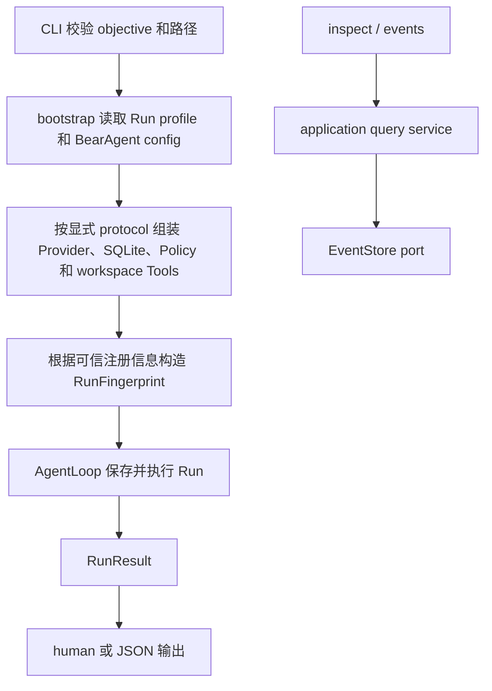

你运行一个文件任务后，最先要回答的不是“模型说了什么”，而是三个更具体的问题：这次 Run 的 ID
是什么、最终状态是什么、哪些事实真的保存下来了。F-0005 用三个命令回答它们：

```powershell
bearagent run "阅读 docs 并把总结写到 outputs/summary.md"
bearagent run inspect <run-id>
bearagent run events <run-id> --after-sequence 0 --limit 100
```

第一条命令默认读取 `data/config.json` 和 `data/p1-run-profile.json`，不需要每次重复传入路径。

本页解释三条命令为什么读取同一批事实。安装、config/profile 全字段、Provider 配置、所有选项、退出码和
排错步骤见[P1 命令行完整使用手册](/zh-cn/guides/cli/)。

## 一次命令怎样接到已有边界



CLI 不计算状态，也不读取 SQLite 表。`run` 把经过校验的 `RunInput` 交给 AgentLoop；`inspect` 和
`events` 把 Run ID 交给 application query service。query service 再通过 EventStore port 读取同一份
projection 和 Event，所以不存在“终端显示成功、数据库却是另一种状态”的第二套规则。

## Run profile 为什么不放密钥

默认配置分成两份。`data/config.json` 描述服务怎样连接和默认使用哪个模型：
`provider_id`、厂商显示名、protocol、HTTPS base URL、直接填写的 `api_key`、模型列表和
`default_model`。该文件被 Git 忽略且必须按敏感文件保护。RunProfile v2
`data/p1-run-profile.json` 只通过 `provider_id` 选择服务，再保存 Agent 指令、Tool 白名单和预算。
Key 和 model 不在 RunProfile 中重复配置；config 明确拒绝 pricing，普通 Run 使用 `unpriced`。

两种配置都是有限大小的普通 UTF-8 JSON 文件。未知字段、链接、非法编码、引用不存在和越界值会在
创建数据库和 Run 前失败。RunProfile v1 仍可读，并映射到 legacy Responses 配置；新配置使用 v2。

profile 不是“每个 Tool 一份 JSON”，也不需要为每个问题重新生成。每个 Tool 的参数 schema 已由
`ToolSpec` 定义；profile 只选择这个 Agent 能看到哪些 Tool。同一 config/profile 可以先后运行
“总结 docs”和“比较两份说明”，每次变化的是 objective。只有服务/model、Agent 指令、预算或 Tool
权限发生变化时才需要修改配置。

仓库提供的 v1/v2 示例 profile 都把预算设为 0。使用它启动 Run 时，AgentLoop 会保存 RunCreated、
RunStarted 和 `budget_exhausted` RunFailed；SDK client 不会创建，模型和 Tool 都不会调用。预算非零
但所选 key 缺失时，首个模型 Activity 和 Run 会以安全的 `provider_authentication` 失败。这两种情况
都能用 `inspect/events` 查看。

## inspect 与 events 看的是不同层次

`inspect` 返回 Reducer 已计算出的完整 RunState，包括预算、usage、Activity、terminal Error 和最后
sequence。新 Run 还显示 RunCreated v4 保存的 `provider_id`、config version、protocol，以及
BearAgent/Policy/Tool contract fingerprints，不显示 base URL、key 或完整 Policy 配置。Tool fingerprint
中的 `spec_version` 标识 schema 之外的 prepare/validation contract，SHA-256 标识完整注册时 ToolSpec。
它们是声明身份，不是 Git 快照、权限或恢复证据。旧 v1-v3 Run 没有 fingerprint 时返回缺失，不会按
当前配置伪造历史值。

Query 还会分页扫描已提交的 Tool completed Event，从 `workspace.write` 结果重建 Artifact 元数据。如果
Event 总量超过可信上限，命令会明确失败，不会把不完整 Artifact 列表说成完整结果。

`events` 返回一页不可变事实，并带回 `next_after_sequence` 和 `has_more`。默认 human 输出每条只显示
sequence、时间、类型和 schema version，不显示 payload。`--json` 是显式完整导出，可能包含用户目标、
模型文本和 ToolResult，不应当作普通日志公开。

## 中断后会看到什么

如果调用被取消，已经提交的 Event 仍在数据库里。`inspect` 会如实显示 `running` 以及最后一个
PENDING/RUNNING Activity；它不会猜测成功，也不会自动追加 RunFailed。若文件已经写成，但
ToolCallCompleted 没有提交，查询也不会从文件系统反推一个 Artifact。

F-0018 用独立子进程把这条规则落到了六个可复现边界：Tool requested/started、`os.replace` 前后、
Event/projection transaction 和 Model started。最容易误判的是 replace 之后：磁盘上已经是新文件，
但最后 committed fact 仍是 `ToolCallStarted`，所以 `inspect` 只显示 RUNNING。测试随后用新 SQLite
adapter 和新的 CLI 进程读取，并确认 Provider/Tool 调用计数没有增加。

`retryable=true` 也只说明错误来源认为另一次尝试可能成功；`ToolRetrySafety` 只是 Tool 声明的粗粒度
提示。两者都不会让 P1 Runtime 获得重试权限。

自动恢复、retry、Attempt、Receipt 和 `UNKNOWN` 仍属于 P2。F-0017 已实现默认关闭的 live runner，
真实 gate 仍必须由项目所有者确认 Provider、model、pricing snapshot 和费用上限后单独执行。2026-08-23
的 DeepSeek V4 suite v1.1.1 已通过 5/5，因此 F-0017/P1 已关闭；runner 默认状态没有改变。

继续阅读[生产 CLI 和查询服务实现导读](/zh-cn/development/run-cli/)，查看代码位置、Schema 和故障测试。
