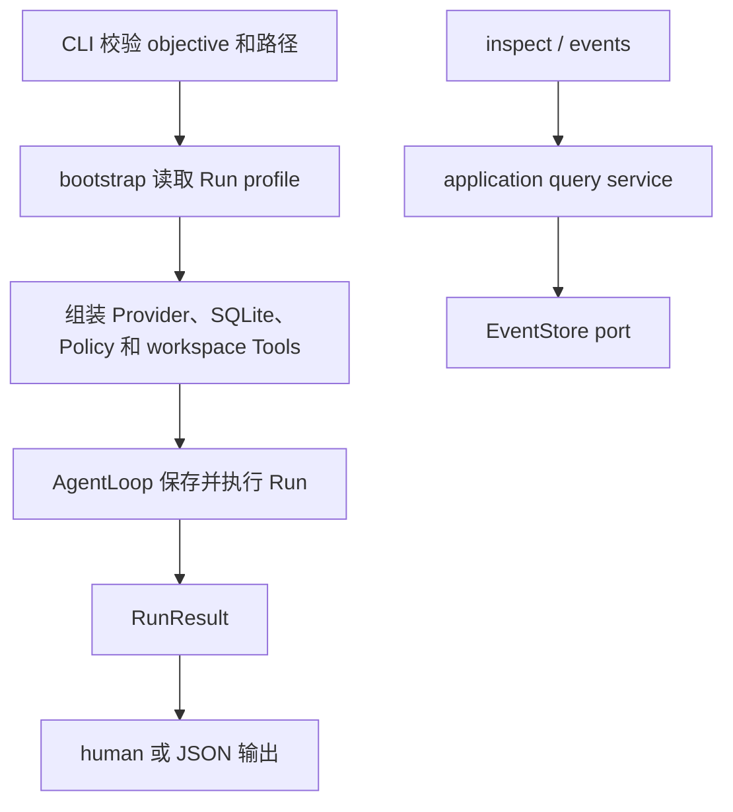

你运行一个文件任务后，最先要回答的不是“模型说了什么”，而是三个更具体的问题：这次 Run 的 ID
是什么、最终状态是什么、哪些事实真的保存下来了。F-0005 用三个命令回答它们：

```powershell
bearagent run "阅读 docs 并把总结写到 outputs/summary.md"
bearagent run inspect <run-id>
bearagent run events <run-id> --after-sequence 0 --limit 100
```

## 一次命令怎样接到已有边界



CLI 不计算状态，也不读取 SQLite 表。`run` 把经过校验的 `RunInput` 交给 AgentLoop；`inspect` 和
`events` 把 Run ID 交给 application query service。query service 再通过 EventStore port 读取同一份
projection 和 Event，所以不存在“终端显示成功、数据库却是另一种状态”的第二套规则。

## Run profile 为什么不放密钥

默认 profile 是 `data/p1-run-profile.json`。它的 version 1 只有两个主体字段：`agent_config` 和
`budget_limits`。model、Prompt、Context、Tool 名称、价格版本和预算会随 RunCreated Event 保存，便于
以后解释这次执行；API key、base URL、workspace 绝对路径和数据库路径不会进入 profile 或 Event。

profile 必须是有限大小的普通 UTF-8 JSON 文件。未知字段、链接、非法编码和越界值都会在数据库写入
和 Provider 调用前失败。Provider 凭据只能从进程环境注入。

profile 不是“每个 Tool 一份 JSON”，也不需要为每个问题重新生成。每个 Tool 的参数 schema 已由
`ToolSpec` 定义；profile 只选择这个 Agent 能看到哪些 Tool。同一份 profile 可以先后运行“总结 docs”
和“比较两份说明”，每次变化的是 objective。只有模型、Agent 指令、预算或 Tool 权限发生变化时，才
需要换 profile。

仓库提供的示例 profile 把预算设为 0。使用它启动 Run 时，AgentLoop 会保存 RunCreated、RunStarted 和
`budget_exhausted` RunFailed；OpenAI SDK client 不会创建，模型和 Tool 都不会调用。预算非零但环境中
没有 Provider 凭据时，首个模型 Activity 和 Run 会以安全的 `provider_authentication` 失败。这两种
情况都能用 `inspect/events` 查看，不再只得到无法定位的 composition 错误。

## inspect 与 events 看的是不同层次

`inspect` 返回 Reducer 已计算出的完整 RunState，包括预算、usage、Activity、terminal Error 和最后
sequence。它还会分页扫描已提交的 v2 Tool completed Event，从 `workspace.write` 结果重建 Artifact
元数据。如果 Event 总量超过可信上限，命令会明确失败，不会把不完整 Artifact 列表说成完整结果。

`events` 返回一页不可变事实，并带回 `next_after_sequence` 和 `has_more`。默认 human 输出每条只显示
sequence、时间、类型和 schema version，不显示 payload。`--json` 是显式完整导出，可能包含用户目标、
模型文本和 ToolResult，不应当作普通日志公开。

## 中断后会看到什么

如果调用被取消，已经提交的 Event 仍在数据库里。`inspect` 会如实显示 `running` 以及最后一个
PENDING/RUNNING Activity；它不会猜测成功，也不会自动追加 RunFailed。若文件已经写成，但
ToolCallCompleted 没有提交，查询也不会从文件系统反推一个 Artifact。

自动恢复、retry、Attempt、Receipt 和 `UNKNOWN` 属于 P2。F-0005 的自动验收使用注入式 Fake Provider，
没有读取真实 key 或调用真实模型。是否把真实模型 API/4-of-5 演练保留为 P1 关闭门，会在 F-0005
完成后单独决定。

继续阅读[生产 CLI 和查询服务实现导读](../development/run-cli.md)，查看代码位置、Schema 和故障测试。
