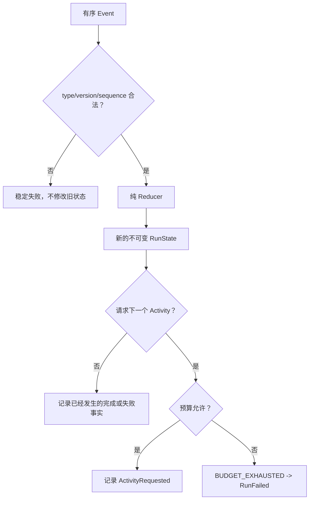

一个普通 Agent demo 往往把“当前做到哪里”和“还剩多少预算”放在 while loop 的局部变量里。
进程结束后，这些变量既无法检查，也很难证明 Store、CLI 和 Runtime 看到的是同一个状态。

F-0002 把这两个问题拆成无 I/O 的确定性规则：Event 描述已经发生的事实，Reducer 从事实推导
不可变状态，budget gate 决定能否请求下一个 Activity。

:::note[内容状态：已实现]
本页描述的 P1 Run/Activity reducer 与预算规则已有代码、schema snapshot 和测试证据。
SQLite 持久化、Agent Loop 和崩溃后自动恢复仍分别属于后续 Feature。
:::

## 状态怎样产生

P1 的 Run 只实现 `QUEUED -> RUNNING -> SUCCEEDED/FAILED`。模型和 Tool 操作不塞进 Run status，
而是各自作为 Activity 经过 `PENDING -> RUNNING -> SUCCEEDED/FAILED`。第一版同时最多一个 active
Activity，这让状态和预算语义保持可解释。

## 五类预算在哪里记账

| 预算 | 记账点 | 新请求怎样判断 |
|---|---|---|
| 模型迭代 | `ModelCallRequested` | 只限制下一次 Model Activity |
| Tool 次数 | `ToolCallRequested` | 只限制下一次 Tool Activity |
| token | 模型完成或失败 Event | 达到 limit 后阻止两类新 Activity |
| 费用 | 模型完成或失败 Event，整数 micro-USD | 达到 limit 后阻止两类新 Activity |
| wall time | `RunStarted` 到候选请求时间 | deadline 后不再请求新 Activity |

token 和费用只有 Provider 返回 usage 后才能精确知道。因此一次已经开始的模型调用可能让实际
usage 超过 limit；Runtime 必须记录这个事实，并阻止后续 Activity，不能假装调用没有发生。
同理，deadline 不会让 Reducer 丢弃迟到的 completion/failure Event。

## 可重放不等于自动恢复

相同 Event sequence 会得到值相等的 `RunState`，这是未来恢复的必要基础，但不是完整恢复能力。
P1 没有 SQLite startup scan、Checkpoint、attempt、cancel、receipt 或 `UNKNOWN`。这些语义必须在
P2 通过持久边界和故障注入另行证明。

继续阅读：[F-0002 开发者实现导读](../development/run-reducer-and-budgets.md)和
[当前实现状态](../project/status.md)。
