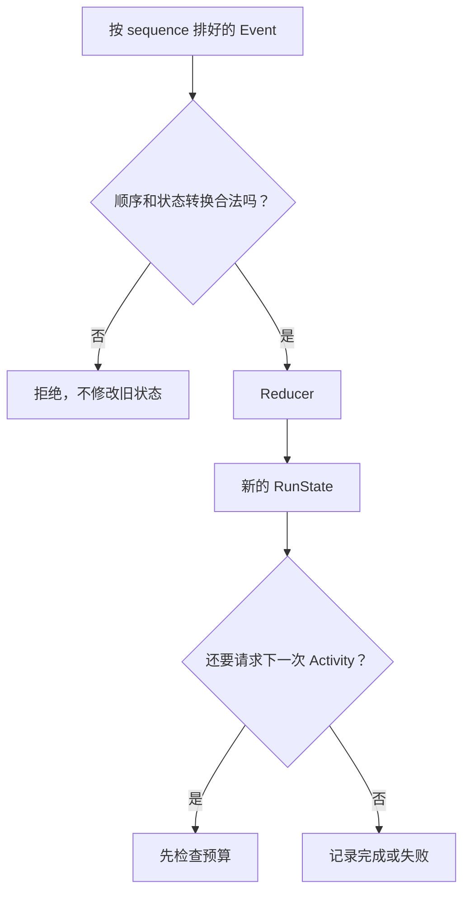

如果执行循环只用几个可变变量保存“做到哪里”和“用了多少 token”，进程结束后就很难还原过程，
SQLite 查询和命令行也可能算出不同结果。F-0002 选择先记录发生过的事实，再用同一段代码计算状态。

:::note[这部分已经实现]
Run、Activity、12 种 Event payload、Reducer 和预算检查已有代码和测试。它们目前只处理内存中的
Event 序列；SQLite 和崩溃后继续执行尚未实现。
:::

## Event 记录事实，Reducer 计算结果

例如，一次模型调用会依次留下“已请求”“已开始”“已完成”三个 Event。Event 不会为了更新状态
而被改写。Reducer 逐条读取这些 Event，返回新的 `RunState`。

```text
旧状态 + 下一条 Event -> 新状态
```

这类把一串输入逐个合并成一个结果的函数通常叫 `reducer`。名称来自 `reduce` / `fold`，不是
“删除 Event”的意思。Reducer 不访问数据库、不调用模型，也不读取系统时钟；同一串 Event 总会
得到值相等的状态。



## Run 和 Activity 为什么分开

Run 表示“处理这一条用户请求”的整体进度。Activity 表示其中一次模型调用或工具调用。P1 的
Run 只有 `QUEUED`、`RUNNING`、`SUCCEEDED`、`FAILED`；每个 Activity 经过 `PENDING`、
`RUNNING`，最后成功或失败。

如果把“正在调用模型”“正在读文件”都塞进 Run 状态，两个层次会纠缠在一起。分开以后，用户
可以看到整次请求是否完成，也能定位具体是哪一次调用失败。

## 五类预算在不同时间记账

| 限制 | 什么时候增加用量 | 什么时候阻止新 Activity |
|---|---|---|
| 模型调用次数 | 接受 `ModelCallRequested` 时 | 下一次模型请求将超过上限 |
| 工具调用次数 | 接受 `ToolCallRequested` 时 | 下一次工具请求将超过上限 |
| token | 模型报告完成或失败时 | 已知用量达到上限 |
| 费用 | 模型报告完成或失败时，以整数 micro-USD 保存 | 已知费用达到上限 |
| 总时间 | 从 `RunStarted` 计算 | 准备请求下一次 Activity 时已过期限 |

token 和费用只有模型返回后才知道准确数字。因此某次已经开始的调用可能让实际用量超过上限。
Runtime 必须保留这个事实，然后禁止下一次 Activity；它不能为了让数字不超限而丢掉完成记录。

## 这还不是崩溃恢复

确定性计算状态是恢复的前提，但不是完整恢复。当前没有 SQLite 启动扫描、Checkpoint、重试
Attempt 或 `UNKNOWN`。P2 才会决定进程重启后哪些 Activity 能重试、哪些必须停住。

继续阅读[逐条读懂一次 Run](run-event-reducer-walkthrough.md)，或进入
[F-0002 代码导读](../development/run-reducer-and-budgets.md)。
