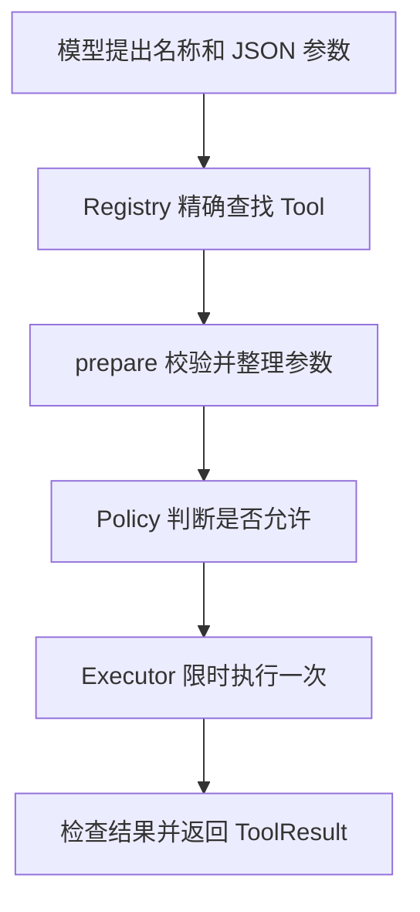

假设模型提出：用 `workspace.read` 读取 `docs/./index.md`。这句话只是模型生成的一份请求数据，
并不表示文件已经打开，更不表示模型获得了读文件权限。

F-0006 做的事情，是在“模型提出请求”和“Tool 产生外部动作”之间建立一条统一路径。以后无论接入
文件 Tool、网络 Tool 还是其他能力，都不能绕过这条路径单独执行。

:::tip[真实 workspace Tool 已通过这条路径]
F-0007 已实现 `workspace.list/read/search`，F-0008 已实现只写 `outputs/**` 的
`workspace.write`。它们都经过 Registry、prepare、固定 Policy 和统一 Executor；F-0016 才会把
ToolExecutor 接进 Agent Loop 并记录完整 Tool Activity Event。
:::

## 先看一遍完整过程



这五个方框不是五套互不相关的代码。`ToolExecutor` 是总调度者，它按固定顺序调用 Registry、Tool
和 Policy；任一步失败，后面的步骤都不会继续。

## 先分清“请求内容”和“可信配置”

初学者最容易混淆的是：模型也会说 Tool 名称、参数甚至“请允许我执行”，为什么 Runtime 不能直接
相信它？因为模型输出和 Tool 配置来自完全不同的地方。

| 信息 | 从哪里来 | Runtime 怎样对待 |
|---|---|---|
| Tool 名称和 arguments | 模型输出 | 不可信，必须校验 |
| `ToolSpec` | 程序启动时注册的 Tool 代码 | 可信配置，单次请求不能覆盖 |
| 允许名单 | Runtime 启动配置 | 复制并冻结，模型不能扩大 |
| Tool 返回数据 | Tool 执行结果 | 仍按不可信结构化数据检查 |

`ToolSpec` 可以理解为一张 Tool 说明卡。它写明 Tool 的完整名称、输入输出结构、副作用类别、timeout、
输入输出字节上限，以及未来是否适合安全重试。模型只能选择一张已经存在的说明卡，不能临时制造一张
权限更大的说明卡。

## 同一个请求会出现三种数据

### 1. ToolRequest：模型提出的原始请求

进入边界时，请求大致是：

```json
{
  "tool_call_id": "一个 UUID",
  "name": "workspace.read",
  "arguments": {
    "path": "docs/./index.md"
  }
}
```

`tool_call_id` 用来把这次请求和最终结果对应起来。`name` 和 `arguments` 都来自模型，Runtime 不会因为
它们能够解析成 JSON 就认为它们安全。

### 2. PreparedToolRequest：检查后的请求

对应 Tool 的 `prepare` 检查参数后，可以把路径整理为：

```json
{
  "tool_call_id": "同一个 UUID",
  "name": "workspace.read",
  "arguments": {
    "path": "docs/index.md"
  }
}
```

这个对象表示“参数已经完成 Tool 自己的检查和规范化”。Policy 和真正的 `execute` 都只接收这份
准备后的请求。

### 3. ToolResult：成功数据或安全错误

成功结果可能是：

```json
{
  "tool_call_id": "同一个 UUID",
  "status": "succeeded",
  "data": {
    "content": "..."
  },
  "error": null
}
```

失败结果则必须包含 `error`，并且不能同时夹带一份不完整的成功数据。这样调用者不需要猜“返回了一半
内容又附带错误”究竟算成功还是失败。

## 第一道检查：Registry 只接受准确名称

`ToolRegistry` 是 Runtime 启动时建立的 Tool 名单。它不扫描模型输出自动创建 Tool，也不做模糊
匹配：

- `workspace.read` 可以找到同名 Tool；
- `Workspace.Read` 不会因为看起来相似而匹配；
- `workspace` 不会自动选择某个默认动作；
- 两个 Tool 使用同一个名称时，Registry 在启动阶段立即报错。

这条规则看似严格，却能避免非常危险的猜测。如果模型拼错了名称，正确结果是明确返回
`tool_not_found`，而不是“尽量帮它找一个差不多的 Tool”。

Registry 还会保存注册时的 `ToolSpec`。即使 Tool 对象后来把自己的 `spec` 属性替换掉，Policy 仍然
看到注册时那份副作用说明。这样，一个原本声明为“代码执行”的 Tool 不能在注册后把自己伪装成
“只读”。

## 第二道检查：prepare 只整理数据，不产生外部动作

不同 Tool 对参数的理解不同，所以通用 Executor 不可能知道每个字段的业务含义。`prepare` 负责：

- 检查必填字段、字段类型和 Tool 自己的约束；
- 把等价输入整理成一种形式；
- 返回新的 `PreparedToolRequest`；
- 保留原来的 `tool_call_id` 和 Tool 名称。

workspace Tool 在这里规范化路径，但不能在这里读写文件、联网或写数据库。真正的外部动作必须等到
Policy 允许后才能发生。

为什么必须先规范化，再检查权限？假设 Policy 检查的是 `docs/allowed/../secret.txt` 这段原始字符串，
而文件系统最终打开的是另一个规范路径，检查对象和执行对象就可能不是同一个资源。先整理成唯一含义，
Policy 才能对真正会执行的参数作决定。

Runtime 还会在调用 `prepare` 前检查序列化后的输入字节数。整个 BearAgent 请求有全局上限，每张
`ToolSpec` 还可以设置更小的 Tool 专属上限。过大的参数不会进入 Tool 代码。

## 第三道检查：Policy 的权限不来自模型

P1 的 `FixedToolPolicy` 故意保持简单：默认拒绝，只允许程序启动时明确列出的名称。它不会读取 Prompt
里的“授权声明”，也不会理会 arguments 里的 `allow: true` 或 `grant: danger.run`。

除了名称允许名单，P1 还检查注册时声明的副作用类别：

| 副作用类别 | P1 行为 |
|---|---|
| `read_only` | 名称在允许名单中才允许 |
| `workspace_write` | 名称在允许名单中才允许 |
| `external_write` | 即使名称在名单中也拒绝 |
| `code_execution` | 即使名称在名单中也拒绝 |

P1 没有用户 Approval，也没有按路径、有效期或 Run 绑定的 Grant。Policy 虽然已经接收规范化参数，
当前只使用名称和可信副作用信息作固定判断；更细的参数级授权属于 P3。

## 第四道检查：Executor 收住失控调用

只有前面全部通过，`ToolExecutor` 才会调用 Tool 的 `execute`。这一段主要处理外部调用最常见的失控
方式：卡住、抛异常、返回错误类型或返回过多数据。

Executor 会：

1. 使用 `ToolSpec.timeout_ms` 限制等待时间；
2. 对同一请求最多调用 `execute` 一次；
3. 检查返回值确实是 `ToolResult`；
4. 检查结果中的 `tool_call_id` 没有被换掉；
5. 按稳定 JSON 编码计算成功数据的 UTF-8 字节数；
6. 超过输出上限时丢弃整份数据并返回失败，不把半截 JSON 当作成功。

这里的 timeout 是异步协作式取消：它能停止正常响应取消信号的 Tool 调用，但不能撤销已经发生的外部
副作用。F-0006 因此不承诺“超时就一定什么都没发生”。后续有副作用的 Tool 仍需要幂等键、结果核对
和 `UNKNOWN` 恢复规则。

## 每种失败都有稳定代码

| 发生了什么 | 返回代码 | Tool 是否真正执行 |
|---|---|---|
| 名称不存在 | `tool_not_found` | 否 |
| 输入过大、prepare 失败或返回非法请求 | `tool_invalid_input` | 否 |
| Policy 拒绝 | `tool_permission_denied` | 否 |
| Tool 超时 | `tool_timeout` | 已调用一次，不自动重试 |
| 成功数据超过上限 | `tool_output_too_large` | 已调用一次，不返回部分数据 |
| Policy 或 Tool 出现其他异常 | `tool_error` | 取决于异常发生位置 |

Executor 不会把原始异常类型、堆栈或异常消息直接返回。调用者因此可以根据错误码处理失败，而不需要
解析一段自由文本，也不会因为一次 Python 异常把密钥带进结果。

调用者主动取消和 timeout 也不是一回事。主动取消会让 `CancelledError` 原样向上传递，Executor 不会
伪造一个普通失败结果。上层 Runtime 才能据此知道“调用者要求停止”，而不是误判为 Tool 自己失败。

## 为什么现在不自动重试

ToolSpec 已经能声明将来是否适合重试，但 F-0006 的 Executor 不读取这个字段发起第二次调用。原因是
“再调用一次”对读操作可能安全，对写文件、发消息或付款却可能重复副作用。

在 Attempt、幂等键、持久 Event 和恢复规则接通之前，最诚实的行为是：执行一次，明确返回结果；
结果不明时不要猜，也不要偷偷再试。

## 这还不是完整文件任务

现在已经实现的是统一 Tool 边界，不是完整 Agent：

- 没有 Tool 会真的打开 `docs/index.md`；
- 没有 Agent Loop 把模型 Tool call 转成 `ToolRequest`；
- Executor 还不写 Tool requested/started/completed/failed Event；
- CLI 还不能启动并查看一次真实文件 Run；
- 没有用户 Approval、sandbox 或进程恢复。

如果你只想建立概念，到这里已经足够。准备第一次读代码时，继续阅读
[F-0006 Tool 执行边界实现导读](../development/tool-execution-boundary.md)，那里会按文件和调用顺序解释
具体实现与测试。
