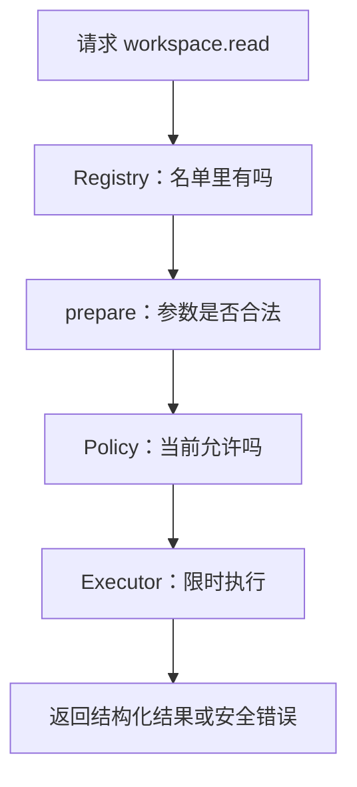

假设模型提出：用 `workspace.read` 读取 `docs/index.md`。模型只是提出请求，它不能因为自己写出了
这个名称，就获得读文件权限。BearAgent 会让请求依次经过四个位置。

:::note[真实只读 Tool 已经接在这条入口后]
F-0007 已实现目录列出、UTF-8 文件读取和普通字符串搜索，并通过下面的名单、参数检查、固定 Policy
和 Executor。F-0016 已把同一入口接进 Agent Loop。
:::

## Registry 只回答“这个 Tool 是否存在”

`ToolRegistry` 是程序启动时建立的 Tool 名单。名称必须完全相同；`workspace.read` 不会匹配
`Workspace.Read`，也不会因为只写了 `workspace` 就猜一个默认 Tool。名单中出现重名时，程序直接
拒绝启动这组 Tool。

这样做的原因很实际：模型拼错名字时，应当得到“Tool 不存在”，而不是意外运行另一个动作。

## prepare 先把参数整理清楚

每个 Tool 的 `prepare` 负责检查自己的参数，并把等价写法整理成一种形式。F-0007 会把
`docs\index.md`、`docs/./index.md` 都整理为 `docs/index.md`。

`prepare` 不能读文件、联网或写数据库。它只处理数据。参数不合法时，请求在这里结束，Policy 和
真正的执行方法都不会运行。

## Policy 独立决定是否允许

P1 的 Policy 很小：默认拒绝，只允许程序启动时明确列出的 Tool。模型参数、Prompt、工作区文件和
Tool 返回值都不能修改这份名单。

Policy 看到的是 `prepare` 整理后的参数。因此不会出现“权限检查时是一个路径，真正执行时变成另一个
路径”。P1 还会始终拒绝外部写入和代码执行。可配置 Grant 和用户 Approval 属于 P3。

## Executor 收住 timeout、异常和大结果

只有通过前三步的请求才会进入 `ToolExecutor`。Executor 对一次请求最多调用 Tool 一次，并使用
`ToolSpec` 中的 timeout、输入字节上限和输出字节上限。

| 发生了什么 | 用户能看到什么 |
|---|---|
| 名称不存在 | `tool_not_found`，Tool 未执行 |
| 参数错误 | `tool_invalid_input`，Tool 未执行 |
| Policy 拒绝 | `tool_permission_denied`，Tool 未执行 |
| Tool 超时 | `tool_timeout`，不自动重试 |
| 结果太大 | `tool_output_too_large`，不返回半截 JSON |
| Tool 抛出异常 | `tool_error`，不暴露原始异常和密钥 |

调用者主动取消时，取消信号会原样向上传递，不会被伪装成普通 Tool 失败。

## 这还不是完整文件任务

F-0006 建好了统一入口，F-0007 已让三个只读 Tool 真正打开受限 workspace，F-0008 也让
`workspace.write` 通过同一入口原子写入 `outputs/**`。F-0016 的 Agent Loop 已调用 Executor 并把请求、
Policy 决定和结果写成 Event；F-0005 的 `run` 与 `inspect` 已用同一 RunState 展示 Tool Activity。

想看路径怎样检查，可以继续阅读
[Windows 和 Unix 路径为什么先变成同一种写法](/BearAgent/zh-cn/learn/workspace-read-boundary/)。
