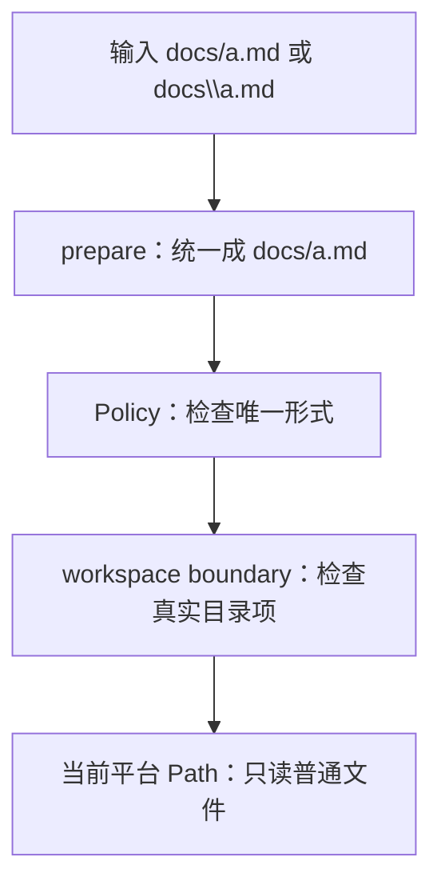

用户或模型在 Windows 上很自然地写：

```text
docs\architecture\overview.md
```

在 Unix 文档中更常见的是：

```text
docs/architecture/overview.md
```

F-0007 接受这两种输入，但不会让它们以两种形式进入权限判断。`prepare` 先把两者都整理成：

```text
docs/architecture/overview.md
```

Policy 因而只检查一种路径。真正读取时，workspace adapter 把每一段交给当前系统的 `Path`。Windows
会访问 Windows 文件系统，Unix 会访问 Unix 文件系统；模型不需要知道 `D:\BearAgent` 这样的宿主
绝对路径。



## 为什么不能直接把字符串交给 Path.open

`../secret.txt` 可以走到父目录；`C:\secret.txt` 和 `\\server\share` 会改变根目录；workspace 内的
symlink 或 junction 还可能跳到外部。只删掉 `..` 不能解决这些问题。

BearAgent 分两层检查：

1. `prepare` 只处理字符串，拒绝绝对路径、盘符、UNC、`..`、设备名和其他不可移植写法；
2. adapter 执行时逐段检查真实文件，不跟随 symlink、junction 或特殊文件，并在打开后再次核对文件
   是否还是检查过的对象。

第一层不能访问文件系统，因为 Policy 必须先看到规范化参数。第二层不能放进 Runtime，因为 junction、
UTF-8 解码和目录遍历都是具体文件 adapter 的工作。

## 三个 Tool 分别回答什么问题

| 问题 | Tool | 结果不完整时怎样说明 |
|---|---|---|
| 这个目录直接包含什么 | `workspace.list` | 返回 `next_offset` |
| 这份文档的第 201 行以后是什么 | `workspace.read` | 返回 `next_start_line` |
| 哪些文本行包含这个普通字符串 | `workspace.search` | 返回 `truncated` 和 `limit_reason` |

list 只列一层。read 只接受 UTF-8 普通文件，并按完整行分页。search 会递归，但只做普通字符串匹配；
它不会把模型输入当成正则表达式，也不会启动外部 `rg` 进程。

每个 Tool 的目录数、文件字节、行长、匹配数、结果大小和时间都有可信上限。模型可以请求更小的一页，
不能把上限调大。

## 链接即使指向内部也不读取

F-0007 保守地拒绝所有 symlink 和 junction。这样会失去一些仓库布局的便利，但同一相对路径只有一个
含义，递归搜索也不会因为链接环路重复进入目录。

这仍不是 sandbox。F-0007 面向单用户、受控本地 workspace；能够并发替换任意祖先目录的本机攻击者
属于 P3 隔离挂载和独立 runner 要处理的威胁。

## 当前已经实现到哪里

三个只读 Tool、路径边界、资源限制和安全错误已有代码与测试，也能经过 F-0006 Registry、固定 Policy
和 Executor。F-0016 的 Agent Loop 已能按模型请求调用它们，F-0005 又把完整文件任务接到 CLI。
写入 `outputs/**` 由 F-0008 的独立 Tool 实现，并通过同一 production composition 调用。

接下来可以阅读[为什么不能直接覆盖输出文件](/BearAgent/zh-cn/learn/atomic-output-boundary/)，或进入
[F-0007 workspace 只读 Tool 实现导读](/BearAgent/zh-cn/development/workspace-read-tools/)。
