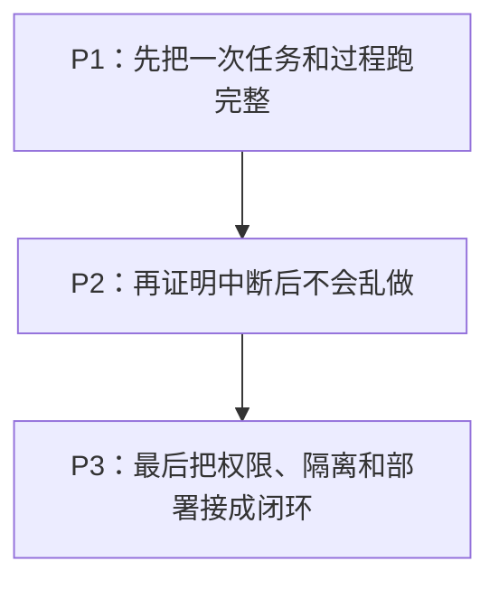

BearAgent 不按“已经写了多少模块”关闭阶段。每个阶段都要在同一组仓库与本地文档任务上给用户
一个新的、可复现的结果。

| 阶段 | 当前状态 | 阶段结束时用户得到什么 |
|---|---|---|
| P0 工程基础 | 已完成 | 仓库可以安装、测试，开发规则和模块边界明确 |
| P1 可检查执行 | 进行中 | 文件任务可以完成，模型和工具的过程、预算与失败可以查看 |
| P2 失败恢复 | 未开始 | 进程中断后只从能确认的位置继续，结果不明的操作会停住 |
| P3 权限与隔离 | 未开始 | 危险操作必须获准，代码只在隔离环境运行，服务可以安全自托管 |
| P4 日常使用 | 未开始 | Skill、MCP、Web 和 Memory 在不绕过原有边界的情况下接入 |
| P5 持续评测 | 未开始 | 可以比较版本变化对任务质量、成本、恢复和安全的影响 |

## P1：完成一次可检查的文件任务

P1 要接通 SQLite、一个真实模型、受限文件工具、有结束条件的 Agent Loop，以及 `run`、`inspect`、
`events` 命令。写入范围固定为 `outputs/**`。完成时，固定测试模型必须完成全部 5 个任务，真实
模型在固定配置下至少完成 4 个，并且非法路径和预算耗尽都有清楚的失败记录。

当前已经完成 SQLite EventStore、首个 OpenAI Responses adapter、Registry、固定 Policy、统一
ToolExecutor、workspace 目录列出、UTF-8 读取、普通字符串搜索，以及 `outputs/**` 原子写入和
Artifact 元数据。F-0016 已用 ContextBuilder 和串行 Agent Loop 把它们接成一次 Run，并让五个
Fake Provider 任务在内存与 SQLite Store 上通过。P1 还需要 F-0005 的 Run CLI、查询输出和真实模型
4/5 退出演练，才能形成阶段要求的用户结果。

P1 只保证已经保存的事实可以查看。进程退出后不会自动继续。

## P2：从已有事实安全继续

P2 会加入 Checkpoint、Attempt、暂停、继续、取消和重试。读操作通常可以重试；已经确认的写入
不能重复；无法确认的外部写入进入 `UNKNOWN`，等待查询或人工处理。

Checkpoint 只是加快恢复。删除它以后，系统仍必须能从完整 Event 重建同一状态。

## P3：让危险操作必须经过授权和隔离

P3 先实现默认拒绝的权限检查和绑定精确参数的批准，再把 shell 或代码执行放进独立 runner，最后
增加认证、HTTPS、备份和真实恢复演练。批准 `write_file(a.txt)` 不能被复用成删除其他文件。

P3 是第一个可信 Runtime 完成线，但仍不是成熟的通用 Agent 产品。Web UI、MCP、Memory 和多个
用户都不在 P3 范围内。

## 阶段怎样关闭

真实任务和失败演练必须能被别人复现；README、架构、Spec、代码、测试和状态页要说同一件事；
当前限制必须直接写出。路线图或架构图本身不能作为“已经完成”的证据。
