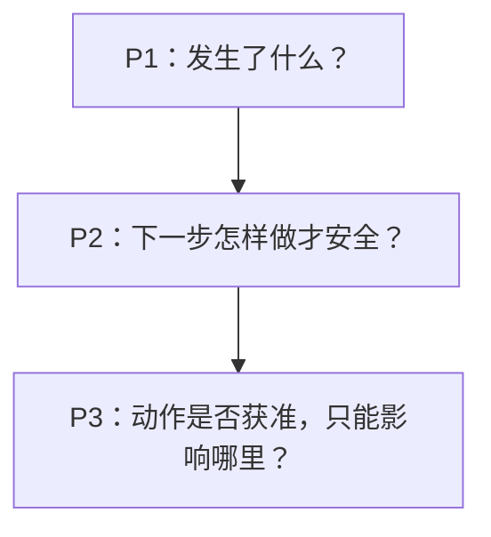

BearAgent 不按“已经写了多少模块”关闭阶段。每个阶段都要在同一组仓库与本地文档任务上给用户
一个新的、可复现的结果。

| 阶段 | 当前状态 | 阶段结束时用户得到什么 |
|---|---|---|
| P0 工程基础 | 已完成 | 仓库可以安装、测试，开发规则和模块边界明确 |
| P1 可检查执行 | 已完成 | 文件任务可以完成，模型和工具的过程、预算与失败可以查看 |
| P2 可恢复执行语义 | 未开始 | 根据已有证据选择复用、重试、核对或停在 `UNKNOWN` |
| P3 授权与隔离执行 | 未开始 | 危险操作必须获准，并且只能在受控 runner 中运行 |
| P4 接入与日常使用 | 未开始 | 安全自托管后，Skill、MCP、Web 和 Memory 依次接入 |
| P5 持续评测 | 未开始 | 可以比较版本变化对任务质量、成本、恢复和安全的影响 |

## P1：完成一次可检查的文件任务

P1 要接通 SQLite、一个真实模型、受限文件工具、有结束条件的 Agent Loop，以及 `run`、`inspect`、
`events` 命令。写入范围固定为 `outputs/**`。完成时，Fake Provider 必须完成全部 5 个任务；一个
显式选择的真实配置必须完成四个普通任务与安全 canary，非法路径和预算耗尽也要有清楚记录。

P1 已完成 SQLite EventStore、三种模型协议 adapter、Registry、固定 Policy、统一 ToolExecutor、
workspace 读写、原子 Artifact、ContextBuilder、串行 Agent Loop、`run/inspect/events`、Provider
catalog、RunProfile v2、RunCreated v3 和默认关闭的 live runner。五个 Fake 任务与最终离线 Reality
Check 通过；suite v1.1.1 又用 DeepSeek V4 经 production 路径完成四个普通任务与安全 canary，并生成
脱敏 report。

P1 只保证已经保存的事实可以查看。进程退出后不会自动继续。

## P2：让每次恢复决定都有依据

P2 会把一个逻辑 Activity 和它的实际 Attempt 分开。重试会创建新 Attempt，不会覆盖旧失败。
Runtime 先判断动作是只读、幂等、可核对还是非幂等，再选择复用、重试、reconcile 或
`UNKNOWN`。一个 Error 写着 `retryable`，不能单独授权系统重做外部写入。

Checkpoint 只是加快恢复。删除它以后，系统仍必须能从完整 Event 重建同一状态。P1 的模型、Tool、
token、费用和时间 hard budget 继续限制所有恢复尝试。

## P3：授权和隔离是两道不同的门

P3 把 Policy 扩展为 `ALLOW / DENY / REQUIRE_APPROVAL`。Approval 绑定具体 Run、Tool call、规范化
参数、有效期和一次性 nonce。批准 `write_file(a.txt)` 不能被复用成删除其他文件。

获得 Approval 后，shell 或代码仍只能进入独立 runner。runner 默认断网、限制文件和资源，而且读不到
Provider key、主数据库、宿主根目录或 Docker socket。Approval 不能扩大 runner 边界，sandbox 也不能
代替 Policy。

P3 是可信 Runtime 内核的完成线。HTTP API、认证、HTTPS、自托管、Web、MCP 和 Memory 都属于 P4。

## P4：先安全接入，再扩大能力

P4 先增加 HTTP/SSE、单用户认证、Compose 加固、备份和恢复，再依次接入 Skill、MCP、Web UI、
Memory 和受控联网。Tool 数量真实增长后，才决定是否需要 Tool selector 或 deferred loading。

## 阶段怎样关闭

真实任务和失败演练必须能被别人复现；README、架构、Spec、代码、测试和状态页要说同一件事；
当前限制必须直接写出。路线图或架构图本身不能作为“已经完成”的证据。
