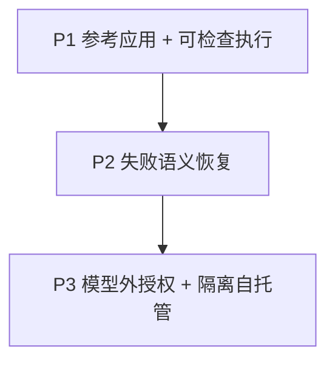

BearAgent 不按功能数量划阶段，而是让 Repo/Document Research Agent 在三个依赖明确的 Runtime 承诺上逐步变得可信。未来计划不会因为出现在这里就变成当前能力。

## 阶段总览

| 阶段 | 状态 | 产品承诺 | 关键证据 |
|---|---|---|---|
| P0 Engineering Baseline | 已完成 | 仓库可以持续、安全地开发 | 包边界、CLI doctor、质量工具和文档治理 |
| P1 Reference Execution | 进行中 | 参考 Agent 的真实本地任务有界、受限、事实可查 | 固定任务集 + Activity/Event/Artifact 视图 |
| P2 Failure-honest Recovery | 未开始 | 同一任务在崩溃后只从可确认边界继续 | kill-point、Checkpoint 重建、receipt/reconcile 与 `UNKNOWN` |
| P3 Governed Self-hosting | 未开始 | 模型外授权、代码隔离、单用户安全自托管 | 同一任务的 Approval 安全、runner 隔离、备份恢复与 HTTPS |

P2 依赖 P1 的 Event/Activity 事实，P3 依赖 P2 的恢复和副作用语义；三个阶段不能用未来能力替代当前验收。

## P1：Inspectable Execution

### 要交付什么

- Run/Activity 状态、纯 Reducer 和迭代/token/费用/时间/Tool 预算；
- SQLite EventStore、projection、migration 和 Artifact metadata；
- 一个真实 Provider-neutral Model Adapter、最小 ContextBuilder、内置参考 Agent 配置与有界 Agent Loop；
- 统一 ToolSpec/ToolResult/Registry/Executor 和固定最小策略门；
- workspace `list/read/search` 与只写 `outputs/**` 的原子 `write_file`；
- `run/inspect/events` CLI、人类可读与 JSON 输出；
- 路径、symlink、timeout、大小上限、错误安全与 schema/contract tests。

### 怎样证明

Repo/Document Research Agent 完成固定仓库与文档任务集，包括读取 `docs/` 并生成 `outputs/intro.md`；随后展示非法路径被拒绝、低预算 Run 明确终止，以及每个模型/Tool Activity 对应的 Event、usage、错误和 Artifact。

### 明确边界

P1 只承诺已提交事实可查。进程退出后不能自动续跑，也没有 Checkpoint、Approval、sandbox、HTTP API、MCP 或 Memory。

## P2：Safe Recovery

### 要交付什么

- Event-only replay 与 Checkpoint + event tail 重建；
- startup recovery coordinator 与可解释恢复决定；
- pause/resume/cancel/retry command 和关联 attempt；
- idempotency key、receipt、workspace write reconcile 与 `UNKNOWN`；
- golden trace、确定性 Fake、kill hook、migration/recovery tests。

### 怎样证明

在模型调用、Tool 完成、原子 replace、cancel 和 projection/Checkpoint 故障点强制结束 runtime。重启后已确认 Activity 不重复，安全 Activity 创建新 attempt，删除 Checkpoint 仍得到同一状态，无法确认的写停在可见的 `UNKNOWN`。

### 明确边界

P2 仍没有 Approval 与 shell runner，因此“等待审批时崩溃”属于 P3。P2 不恢复 Python 调用栈或 token stream，也不承诺外部写 exactly-once。

## P3：Governed Self-hosting

### 要交付什么

- 默认拒绝的 Grant/Policy 与绑定精确参数的一次性持久 Approval；
- `WAITING_APPROVAL` 跨重启恢复、过期/重放/参数替换阻断；
- rootless 独立 runner、资源/输出/网络限制和 secret/host 隔离；
- 与 CLI 共用 application command 的 FastAPI/SSE、单用户认证和安全错误；
- Compose、HTTPS、healthcheck、SQLite online backup 与空目录 restore drill；
- 权限绕过、prompt injection、runner escape、SSE 重连和重复副作用测试。

### 怎样证明

高风险代码执行进入等待审批；修改参数后旧 Approval 失效。原请求批准后只在 runner 中执行，读取不到 provider key、宿主目录和 Docker socket。服务在审批与执行边界重启后按 P2 语义继续，并能从 SQLite + Artifact 备份恢复审计记录。

### 明确边界

P3 是 headless CLI/API 单用户 beta。Web UI、Skills、MCP、Memory、浏览器、Multi-Agent、多用户和分布式 worker 仍在后续阶段。

## P3 为什么是第一个完整项目

到 P3，BearAgent Runtime 与首个参考应用才同时具备：真实任务闭环、持久事实、崩溃恢复、诚实副作用语义、模型外授权、代码隔离、认证、自托管和备份恢复。它仍然功能少，只代表第一个可信 Runtime 完成线，不代表成熟通用 Agent 产品。

## 阶段什么时候可以关闭

除了工程 Roadmap 的退出门槛，每个阶段还必须完成：

- **学习闭环**：相关 Feature 在初学者路径中形成连续知识层次；
- **开发闭环**：真实入口、架构边界、失败语义和验证命令有开发者导读；
- **事实闭环**：README、当前状态、已知限制、Spec、代码和测试一致；
- **演示闭环**：旗舰 Demo 与失败/安全演练可由他人复现。

完整 Feature 切片和验收矩阵见工程[路线图](https://github.com/CherryYang05/BearAgent/blob/main/docs/project/roadmap.md)。
