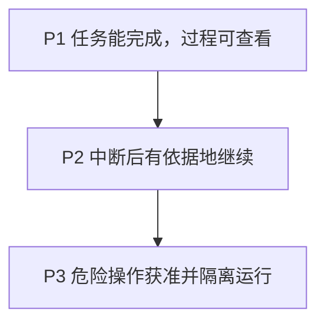

BearAgent 不按功能数量划阶段。P1 至 P3 使用同一组仓库与本地文档任务，依次证明“过程可查”“中断后不乱重试”和“危险操作必须获准”。路线图中的能力不等于当前已经可用。

| 阶段 | 状态 | 用户得到什么 | 关闭阶段的核心证据 |
|---|---|---|---|
| P0 工程基础 | 已完成 | 仓库可安装、可测试、开发规则明确 | CI、架构边界和文档治理 |
| P1 可检查执行 | 进行中 | 真实本地任务可以完成，过程和失败可查看 | 固定任务集、路径拒绝、预算终止、完整执行记录 |
| P2 失败恢复 | 未开始 | 进程中断后只从可确认的位置继续 | 中断演练、状态重建、不重复写入、不确定操作停住 |
| P3 权限与隔离 | 未开始 | 危险操作必须获准，代码隔离运行，并可安全自托管 | 审批安全、隔离测试、备份恢复和 HTTPS |
| P4 日常使用 | 未开始 | 依次获得 Skill、MCP、Web 和带来源的 Memory | 扩展不绕过原有权限和记录路径 |
| P5 持续评测 | 未开始 | 可以比较版本变化带来的质量、成本和安全回归 | 固定数据集、执行路径断言和发布报告 |

P2 依赖 P1 的执行记录，P3 依赖 P2 的恢复规则。后一个阶段不能替前一个阶段补作业。

## P1：可检查执行

### 用户结果

仓库与本地文档研究助手可以读取限定工作区中的资料，并把报告或说明写入 `outputs/**`。用户可以查看每次模型调用、工具操作、预算、错误和输出文件。

### 主要工作

- 定义一次任务及其中每次模型、工具操作的状态和预算；
- 使用 SQLite 保存有顺序的执行记录；
- 接入一个真实模型，并建立最小上下文和有结束条件的执行循环；
- 提供受限的目录查看、文件读取、内容搜索和原子写入；
- 提供 `run`、`inspect`、`events` 命令；
- 建立固定任务集：测试用模型必须 5/5，真实模型在固定配置下至少 4/5。

- Run/Activity 状态、纯 Reducer 和迭代/token/费用/时间/Tool 预算；
- SQLite EventStore、projection、migration 和 Artifact metadata；
- 一个不依赖特定模型服务商的真实模型适配器与有界 Agent Loop；
- 统一 ToolSpec/ToolResult/Registry/Executor 和固定最小策略门；
- workspace `list/read/search` 与只写 `outputs/**` 的原子 `write_file`；
- `run/inspect/events` CLI、人类可读与 JSON 输出；
- 路径、符号链接、超时、大小上限、错误安全、数据格式快照和共用接口测试。

### 暂时没有

P1 只保证已保存的事实可查。进程退出后不会自动续跑，也没有用户审批、代码隔离、HTTP API、MCP 或 Memory。

## P2：失败恢复

### 用户结果

进程意外退出后，BearAgent 根据已有记录决定继续、重试还是停住。已确认成功的文件操作不会重复；无法确认结果的操作显示为 `UNKNOWN`，等待用户处理。

### 主要工作

- 从完整事件记录重建任务状态，Checkpoint 只用于加速；
- 支持暂停、继续、取消和重试；
- 每次重试保留新的 Attempt，不覆盖旧记录；
- 使用幂等键、文件 hash 或外部 Receipt 核对操作结果；
- 在模型调用、工具完成和文件替换等位置强制结束进程并验证恢复。

### 暂时没有

P2 仍不提供代码执行和用户审批，也不承诺无法查询的外部写入一定只发生一次。

## P3：权限、隔离与自托管

P3 按三道门推进：

1. **权限门**：默认拒绝，危险请求必须由用户批准，批准内容绑定精确参数；
2. **隔离门**：代码只能在受限环境运行，无法读取 Runtime 密钥和宿主资源；
3. **部署门**：加入认证、HTTPS、备份和真实恢复演练。

### 用户结果

用户可以知道某个动作为什么被允许或拒绝。修改已经批准的参数会使旧批准失效。隔离环境无法读取 Provider key、宿主目录、主数据库或 Docker socket。

### 暂时没有

P3 仍是单用户命令行/API beta。Web UI、Skills、MCP、Memory、浏览器、多 Agent、多用户和分布式 worker 都在后续阶段。

## P4：扩展与日常使用

先加载一个版本化只读 Skill，证明说明文件不能扩大权限；再接入一个受控只读 MCP Tool，证明外部工具仍经过相同的权限、记录、超时和输出限制。之后才增加 Web UI、带来源且可删除的 Memory 和受控联网能力。

## P5：持续评测

评测从 P1 就开始。P5 将 P1 的任务基线、P2 的恢复演练和 P3 的安全演练接入统一追踪，支持跨模型、Prompt、Skill 和 Tool 版本比较。

## 阶段什么时候可以关闭

每个阶段都必须同时完成：

- 真实任务与失败演练可以由他人复现；
- README、状态页、架构、Spec、代码和测试说法一致；
- 初学者能理解新增概念，开发者能找到实现入口和验证命令；
- 当前限制被明确写出，没有把未来计划说成现有能力。

完整 Feature 切片和验收矩阵见工程[路线图](https://github.com/CherryYang05/BearAgent/blob/main/docs/project/roadmap.md)。
