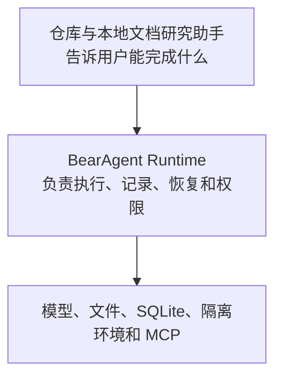

> **BearAgent 让个人 Agent 在本地可靠地完成长任务：每一步可查看，失败后不乱重试，危险操作必须获得授权。**

:::caution[内容状态：已接受定位 + 分阶段目标]
当前只完成工程基础、领域契约和本地文档站，尚不能执行真实 Agent 任务。请同时查看[当前实现状态](status.md)。
:::

## 先服务谁

BearAgent 首先服务愿意在本机或自己的服务器上运行 Agent 的个人开发者、研究者和高级用户。第一个场景是仓库与本地文档研究：读取限定目录中的资料，比较内容，并把结果写入 `outputs/**`。

P1 不做联网搜索，也不把 BearAgent 包装成全能个人助理。

## BearAgent 负责什么

1. **过程可查**：模型和工具做过什么、用了多少预算、哪里失败、生成了什么文件。
2. **恢复有依据**：已确认完成的操作不重复；无法判断结果时停下来，不用猜测继续。
3. **权限在模型之外**：模型只能请求工具，真正的允许、询问或拒绝由运行时决定。

## 与其他 Agent 有什么不同

BearAgent 不声称其他项目没有持久化、审批或沙箱。Proma、Manus、Claude Code 更靠近完整产品；DeepTutor 服务教学场景；LangGraph、Pydantic AI 更适合搭建和编排 Agent；Inspect、E2B、MCP 分别解决评测、隔离执行或工具连接。

BearAgent 选择负责一个更窄的边界：在个人可维护的本地系统里，用同一份执行记录说明任务做过什么、为什么继续或停下，以及每个动作为什么被允许。

## 怎样证明

| 阶段 | 用户看到的变化 | 主要证据 |
|---|---|---|
| P1 可检查执行 | 固定本地任务可以完成，过程和失败可查看 | 任务集、路径拒绝、预算终止、完整执行记录 |
| P2 失败恢复 | 中断后只从可确认的位置继续 | 多个中断点、状态重建、不重复写入、不确定操作停住 |
| P3 权限与隔离 | 危险动作必须获准，代码隔离运行 | 参数篡改被拒绝、密钥隔离、备份恢复 |
| P4 日常使用 | 依次加入 Skill、MCP、Web 和 Memory | 扩展仍经过原有权限和记录路径 |
| P5 持续评测 | 跨版本比较质量、成本和安全回归 | 固定数据集、执行路径断言和发布报告 |

评测从 P1 就开始。P5 负责把前面阶段积累的任务、恢复和安全证据变成持续比较的平台。

工程层面的完整说明见仓库中的[产品定位](https://github.com/CherryYang05/BearAgent/blob/main/docs/project/product-positioning.md)，交付顺序见[阶段与里程碑](milestones.md)。
