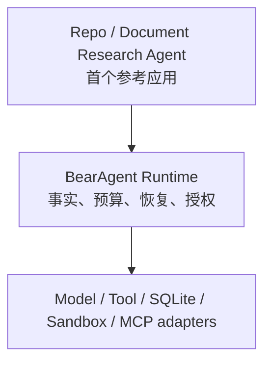

BearAgent 是一个**面向本地长任务、失败语义诚实的 local-first Agent Runtime**：它把模型与工具动作记录为持久事实，由模型外的确定性 Policy 强制授权；崩溃后只在结果可确认时继续，无法确认的外部副作用停在 `UNKNOWN` 等待 reconcile。

:::caution[内容状态：已接受定位 + 分阶段目标]
定位描述 BearAgent 要成为的产品。当前只完成工程基线、领域契约和本地文档站，尚不能执行真实 Agent 任务；请同时查看[当前实现状态](status.md)。
:::

## 这不是“别人都做不到”

成熟 Agent 已经以不同粒度提供 transcript、checkpoint、approval 和 sandbox。BearAgent 不把功能存在性当作独占卖点，而是验证一项更窄的假设：这些能力能否统一到 Activity、Attempt、Event、Receipt 与 Policy 契约中，并在故障后明确区分“确认成功”“可以安全重试”和“结果未知”。

在故障注入、恢复轨迹和权限测试完成前，这仍是设计主张，不是已经成立的优势。

## Runtime 与首个参考应用

Runtime 回答“任务怎样被执行和约束”；参考应用回答“用户究竟能交付什么任务”。同一组真实仓库与文档任务会贯穿 P1-P3，避免只完成基础设施却没有产品闭环。

## BearAgent 负责回答三个问题

1. **发生了什么？** 模型与 Tool Activity、Attempt、预算、错误和 Artifact 都有结构化事实。
2. **失败后能否继续？** 只有 Event、idempotency key、receipt 或 reconcile 能确认结果时才继续；否则进入 `UNKNOWN`。
3. **这件事允许发生吗？** 权限来自模型之外的 Runtime Policy 与精确 Approval，不来自 Prompt、模型或 Tool 输出。

## 它不是什么

- 不是以模型、Tool、渠道和角色数量取胜的“万能 Agent”；
- 不是 Manus、Claude Code 或其他产品的开源复刻；
- 不是只供开发者组装图节点的通用 framework；
- P1-P3 不是企业多租户平台或无代码 Workflow builder。

## 差异化怎样被证明

| 阶段 | 用户价值 | 可复现证据 |
|---|---|---|
| P1 Reference Execution | 参考 Agent 完成固定真实任务，过程可查 | 路径拒绝、预算终止、Activity/Event/Artifact 视图 |
| P2 Failure-honest Recovery | 崩溃后只从可确认边界继续 | kill-point、Checkpoint 重建、receipt/reconcile 与 `UNKNOWN` |
| P3 Governed Self-hosting | 动作只能在授权与隔离边界内发生 | Approval 篡改阻断、runner 隔离、备份恢复 |
| P4 Extension Proof | 扩展生态不绕过内核语义 | 一个受控 Skill/MCP 经同一 Policy/Event/ToolResult 路径运行 |

工程层面的完整定位和措辞边界见仓库中的[产品定位](https://github.com/CherryYang05/BearAgent/blob/main/docs/project/product-positioning.md)，详细交付顺序见[阶段与里程碑](milestones.md)。
