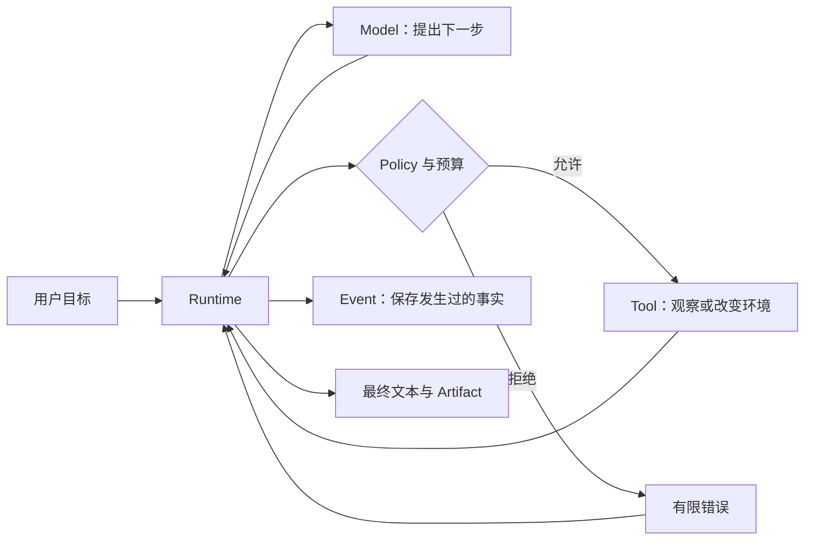

你让一个聊天模型“总结这些文档”，它通常只需要生成一次回答。你让 Agent “自己查找相关文件、比较
内容、把结果写到指定位置”，事情就变了：任务会持续多步，模型会请求 Tool，进程也可能在某一步
中断。

此时最危险的误解是：**只要模型足够强，整个系统就会可靠。** 模型能提出下一步，却不知道文件是否
真的写成、权限是否允许、预算是否耗尽，也不应该自己授予这些权限。

BearAgent 负责模型之外的这层执行工作。这一层叫 Runtime：它把目标、模型、Tool、预算和持久化接成
一次有边界、可检查的 Run。

## 用一个任务看清分工

用户提出：

> 阅读 `docs/` 中与架构有关的内容，写一份不超过 800 字的介绍到 `outputs/intro.md`。

这项任务会产生七个问题：

| 问题 | 谁负责 |
|---|---|
| 下一步读哪个文件、何时总结 | Model 提议 |
| 这次模型应该看到哪些历史 | Runtime 的 ContextBuilder |
| 路径是否仍在 workspace | workspace adapter |
| `workspace.write` 是否允许执行 | Runtime 的 Policy |
| 还剩多少模型、Tool、token、费用和时间预算 | Runtime 的预算规则 |
| 发生过哪些调用、结果和错误 | EventStore 保存事实，Reducer 计算状态 |
| 最终文件是否完整提交 | workspace.write 的原子提交边界 |

Model 和 Tool 的输出都被当成不可信数据。Model 不能绕过 Runtime 直接读写文件；Tool 结果也不能反过来
创建权限。

## 为什么项目先做一个很小的文件任务

BearAgent 的第一个场景固定为：在指定 workspace 中列出、读取和搜索文本，只向 `outputs/**` 写入
有限 UTF-8 文件。这个场景足够小，能用测试精确检查路径、预算、Event 和文件结果；又足够完整，能
暴露真实 Agent Runtime 会遇到的模型协议、Tool 调用、持久化和失败窗口。

第一版保持单用户、单 Agent、单个 Runtime 进程、SQLite 和 CLI。HTTP、MCP、Memory、浏览器和多个
Agent 都会扩大能力表面，却不会自动解决“动作是否发生”“能否安全重试”“权限从哪里来”。

## “可检查”还不等于“可恢复”

P1 已能保存和查询发生过的事实。假设文件已经被完整替换，但进程在保存成功 Event 前退出：重启后
可以看到 Run 停在非终态，却还不会自动判断文件结果，也不会自动继续。

P2 才会引入 Attempt、Receipt、reconcile 和 `UNKNOWN`，根据证据选择复用、重试、核对或停下。P3
再增加绑定具体参数的 Approval 和隔离 runner。`UNKNOWN` 是“证据不足，不能安全声称结果”，不是
普通失败的另一种叫法。

:::note[当前成熟度]
P1 的本地文件任务、查询和真实模型 gate 已完成；P2/P3 尚未实现。文档站可以在本地开发、构建和
预览，但它不部署 Runtime，也不绑定在线托管平台。准确清单见[当前实现状态](/zh-cn/project/status/)。
:::

下一步建议先[亲手运行一次](/zh-cn/learn/first-run/)。如果暂时不想配置真实模型，也可以直接阅读
[一次文件任务的完整链路](/zh-cn/learn/agent-loop-file-task/)。
